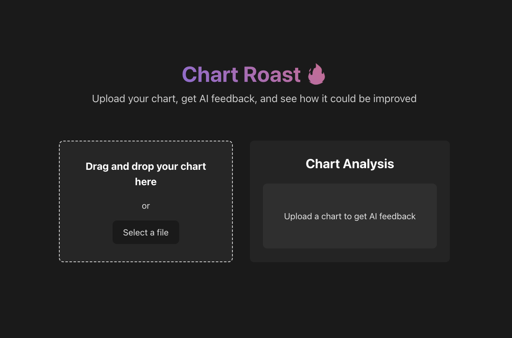
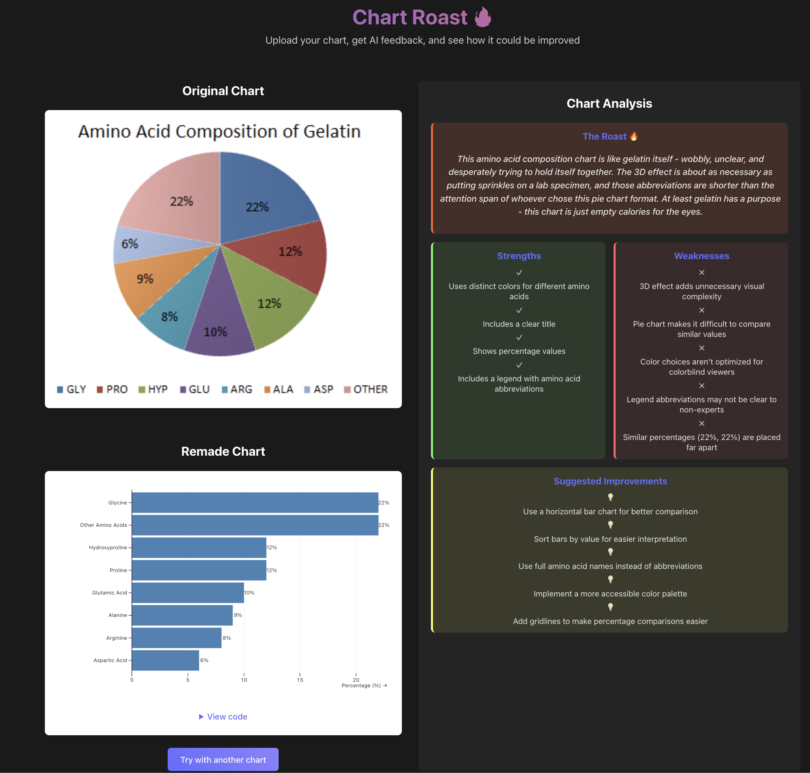

# Chart Roast 🔥



Chart Roast is a playful web application that uses AI to analyze and "roast" your data visualizations. Upload your chart and get instant feedback on:

- Chart type identification
- General feedback on structure and clarity
- Aesthetics feedback
- Accessibility suggestions
- A tongue-in-cheek "roast" of your chart
- Data extraction from the image
- A suggested remake using Observable Plot



## Features

- Drag and drop file upload for charts and visualizations
- Instant AI analysis via Anthropic (simulated in this demo)
- Side-by-side comparison of original and remade charts
- Detailed feedback across multiple categories

## Getting Started

1. Clone this repository
2. Install dependencies:

   ```bash
   yarn install
   ```

3. Create a `.env` file in the root directory with the following and [get your API key](https://console.anthropic.com/settings/keys):

   ```bash
   ANTHROPIC_API_KEY=your_anthropic_api_key
   ```

4. Start the development server:
   ```bash
   yarn dev
   ```
5. Open your browser to the URL shown in the terminal

## Implementation Notes

This is a proof of concept that shows how AI can be used to analyze and improve data visualizations. In a production version:

- The Anthropic API would be integrated with proper authentication
- The Observable Plot library would be used to render the improved chart
- Additional options for customizing the suggested improvements would be available

## Technology Stack

- [Vue 3](https://vuejs.org/) + [TypeScript](https://www.typescriptlang.org/) + [Vite](https://vitejs.dev/)
- [Observable Plot](https://observablehq.com/plot/)
- [Anthropic API](https://console.anthropic.com)

## Brainhack Warsaw 2025

[Brainhack Warsaw 2025](https://brainhackwarsaw.fuw.edu.pl/), project [AI Chart Surgeon: Improving Visualizations, One Graph at a Time](https://brainhackwarsaw.fuw.edu.pl/?page_id=1841).

## Team

Leaders: [Piotr Migdał](https://p.migdal.pl/), [Katarzyna Kańska](https://github.com/kkanska)

Participants: [Małgorzata Dąbkowska](https://www.linkedin.com/in/ma%C5%82gorzata-d%C4%85bkowska-40b836238/), Karol Dąbrowski and Błażej Rozwoda

## License

MIT

## More

If you like to create good charts easily, check [Quesma Charts](https://charts.quesma.com/) led by Piotr Migdał.
